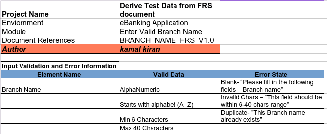
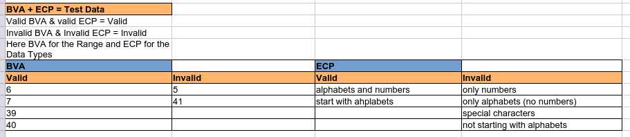
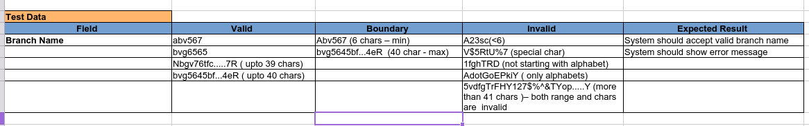

# BVA & ECP Test Data – Branch Name Validation
This project contains test data using BVA and ECP techniques.
## 📌 Objective
Apply Boundary Value Analysis and Equivalence Partitioning.

---

## 📊 Test Coverage
- Valid inputs
- Invalid inputs
- Edge cases

---

## 📁 File
- [BVA_ECP_Test_Data.xlsx](./BVA_ECP_Test_Data.xlsx)  
---

## 📷 Screenshots

### Input Validation Example

### Boundary Values

### Test Data Example

## ✅ Skills Demonstrated
- Boundary Value Analysis (BVA)
- Equivalence Partitioning (ECP)
- Test Data Design
