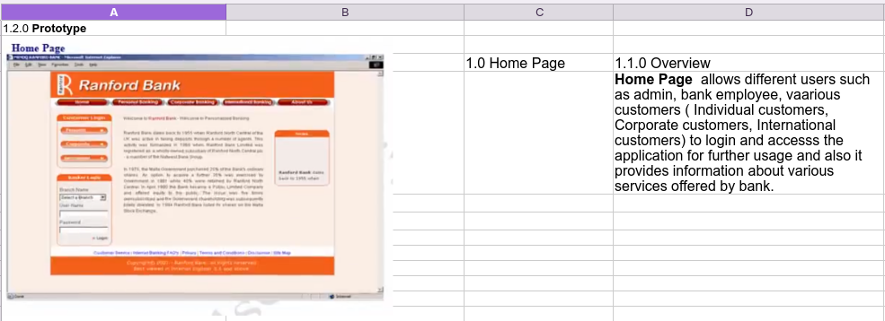
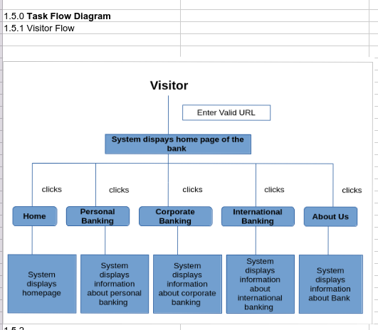
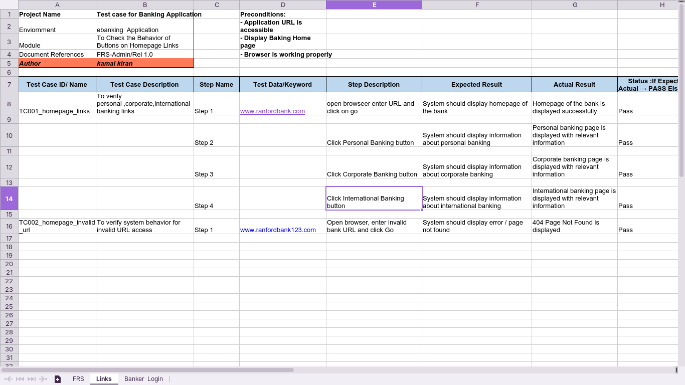
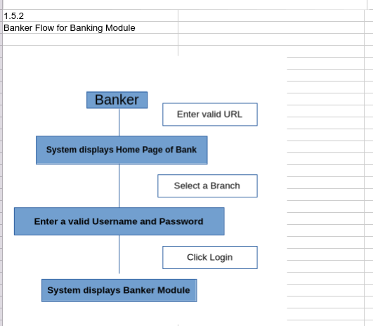
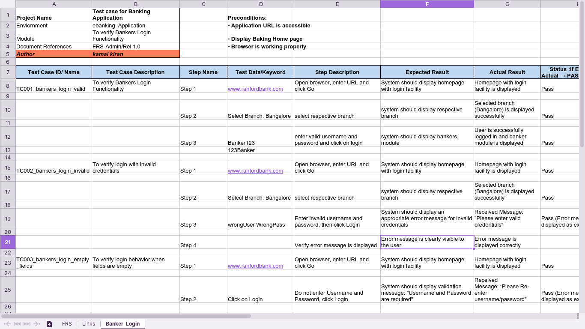
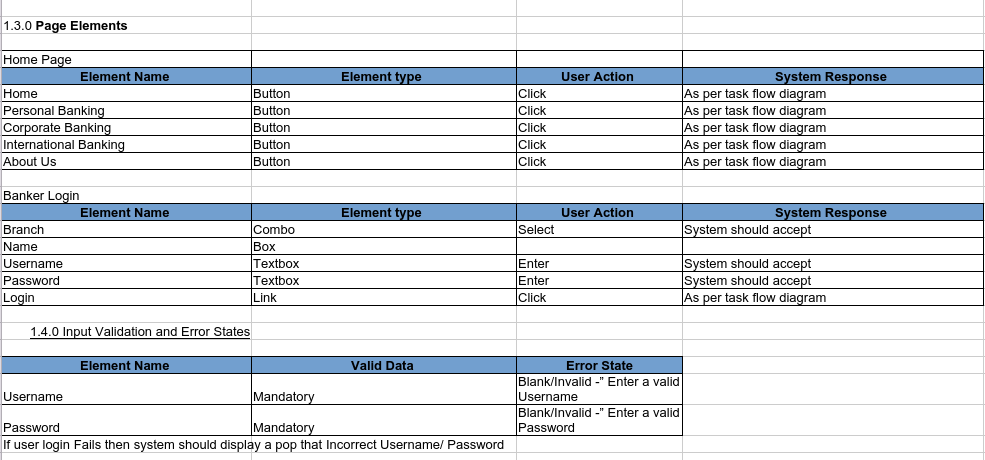
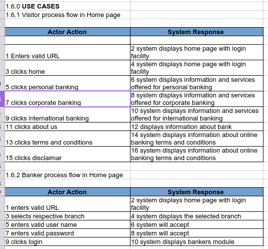

# 🏦 Banking Application Testing – Manual QA Project

🔗 Application URL: http://www.ranfordbank.com

---

## 📌 Application Overview

This project focuses on testing a demo banking application covering homepage navigation and banker login functionality.

The application supports multiple user interactions including:
- Personal Banking
- Corporate Banking
- International Banking
- Banker Login

---

## 🎯 Objective

To validate:
- Homepage navigation links functionality
- Banker login flow
- Input validations and system behavior

---

## 📋 Test Coverage

### 🔹 Homepage Testing
- Navigation through Personal Banking
- Corporate Banking access
- International Banking access
- UI navigation validation

### 🔹 Banker Login Testing
- Branch selection
- Username & Password validation
- Successful login verification

---

## 📁 Files Included

- [Test_Case_Banking_Application.xlsx](./Test_Case_Banking_Application.xlsx)

- 📸 Screenshots: Available in `/screenshots` folder

---

## 🔄 Test Scenarios

###🔹 **Links Tab**
### ✔ TC001 – Homepage Links Validation
- Verify homepage loads successfully
- Validate Personal, Corporate, International banking links

###🔹 **Banker Login Tab**
### ✔ TC001 – Banker Login Validation
- Verify login page accessibility
- Validate branch selection
- Verify successful login with valid credentials

---

## 📸 Screenshots

### 🔹 Application Prototype
- Homepage UI design overview

---

### 🔹 Visitor Flow (Homepage Navigation)

---

### 🔹 Homepage Links Testing

---

### 🔹 Banker Flow Diagram

---

### 🔹 Banker Login Execution

---

### 🔹 Page Elements & Validation Rules

---

### 🔹 Use Case Scenarios

---

## 🧪 Testing Type

- Functional Testing  
- UI Testing  
- Positive & Negative Testing  

---

## 🧠 Skills Demonstrated

- Test Case Design & Execution  
- Functional & UI Testing  
- Defect Identification  
- Requirement Analysis (FRS)  
- Test Scenario Mapping  

---

## 🔍 Key Learnings

- Understanding banking workflows and user flows  
- Validating UI navigation and login systems  
- Mapping FRS → Test Cases → Execution  
- Structuring real-world manual QA documentation  

---

## ⚠️ Note

This project is based on a demo banking application used for testing practice.  
All test scenarios are derived from FRS, UI design, and expected system behavior.

---

