# E-commerce QA Testing Project (Jira + Zephyr)

## Overview
This project demonstrates end-to-end manual testing of an E-commerce web application using Jira for project management and Zephyr for test management.

## Objective
To simulate a real-world QA workflow including requirement analysis, test planning, execution, and defect tracking.

## Tools Used
- Jira (Agile Project Management)
- Zephyr (Test Case Management)
- Manual Testing

## Work Done
- Created Epic and User Stories
- Planned and executed Sprints
- Created Test Cases as Subtasks
- Executed test cases
- Logged defects and tracked them
- Managed test cycles using Zephyr

## Features Tested
- Product selection
- Wishlist functionality
- Add product to cart
- Admin adding products to selling list

# Screenshots

# Epic & Stories

### Default Dashboard
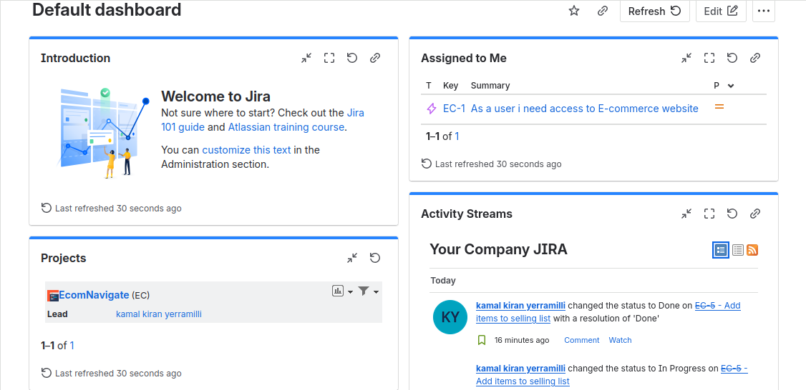

### Epic Overview
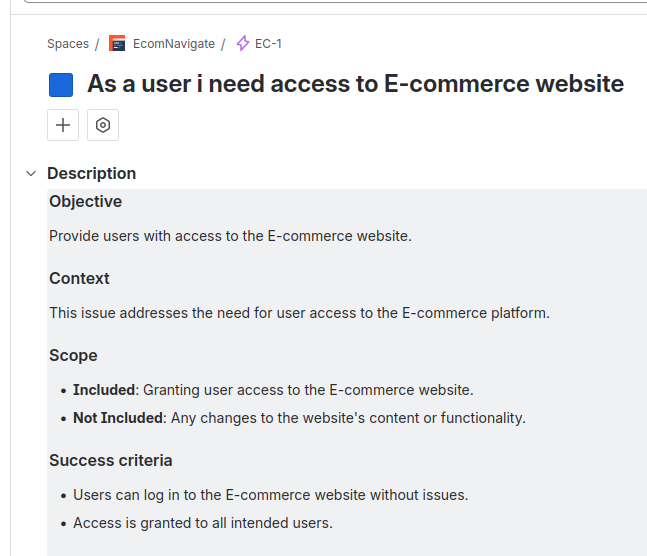

### User Stories Linked to Epic
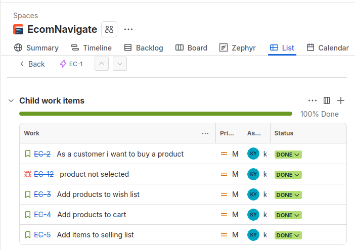

# Sprint Execution

### Backlog & Sprint Planning
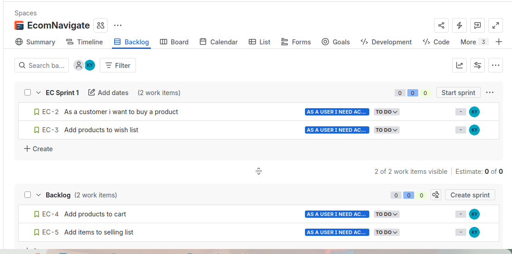

### Sprint Started
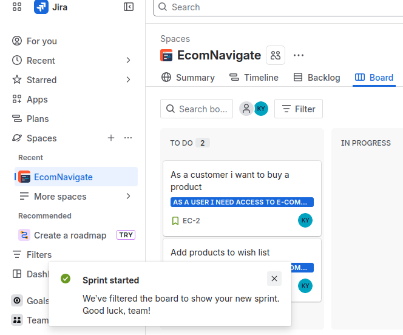

# Test Execution

### Subtasks (Test Cases)
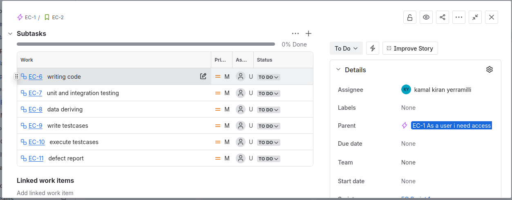

### All Subtasks Completed
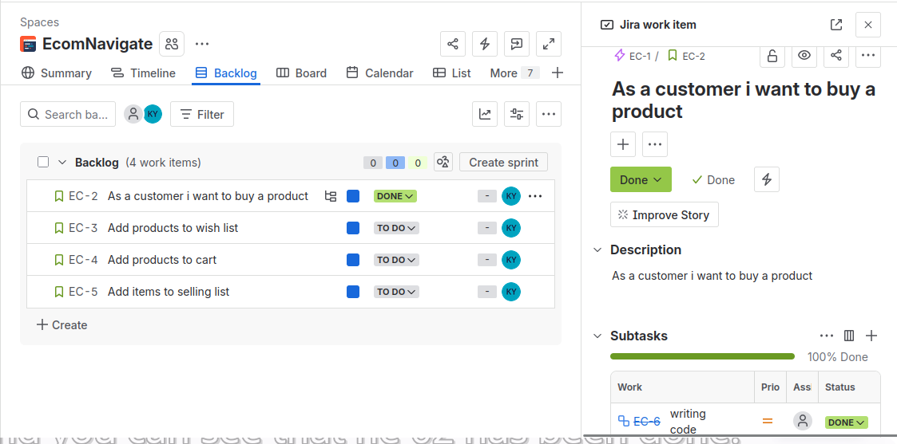

### Sprint Completed
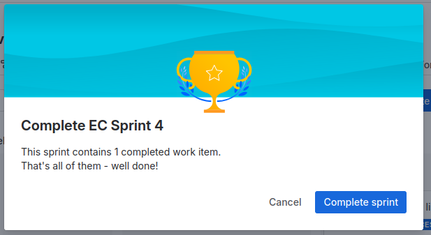

# Bug Tracking

### Bug Created
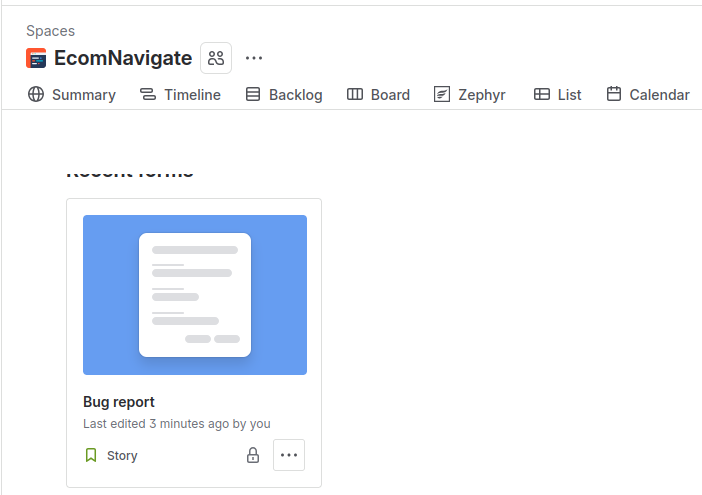

### Bug in Sprint
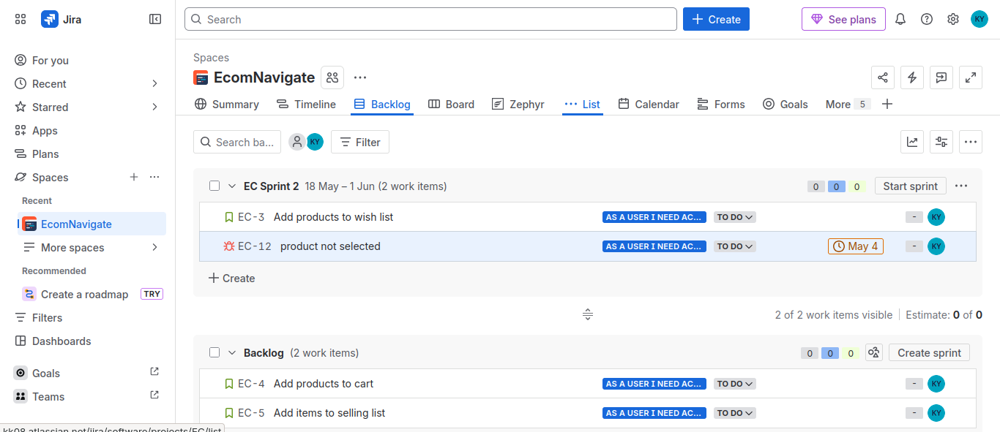

# Zephyr Test Management

### Test Cycle Created
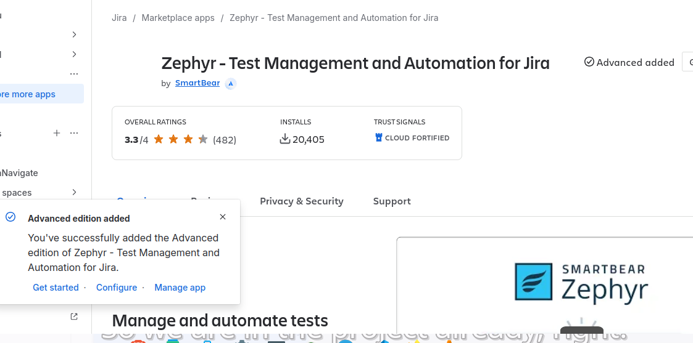

### Test Cycle Executed
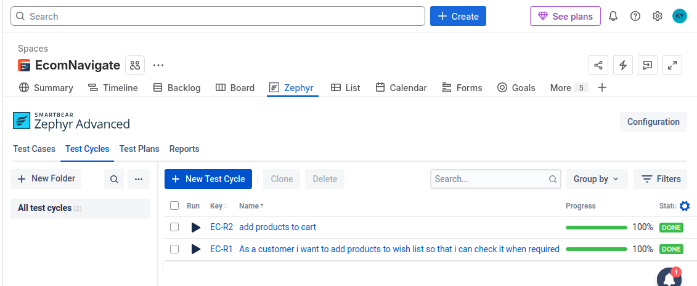

# Application Testing

### Homepage

### Products

### Cart & Checkout
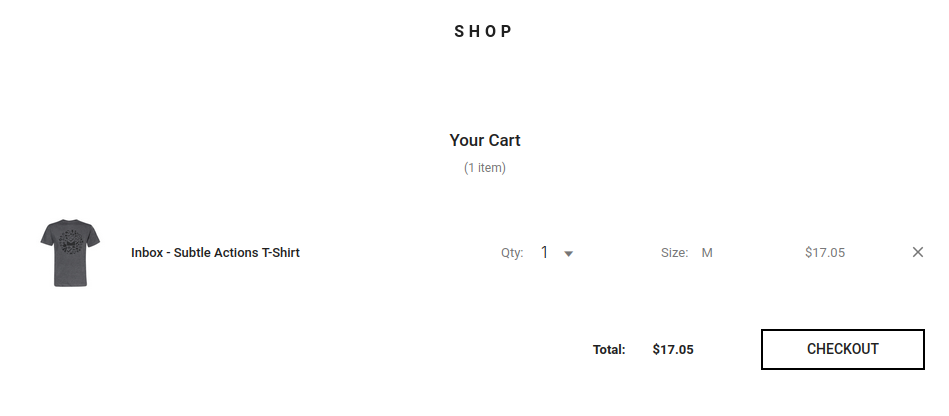
