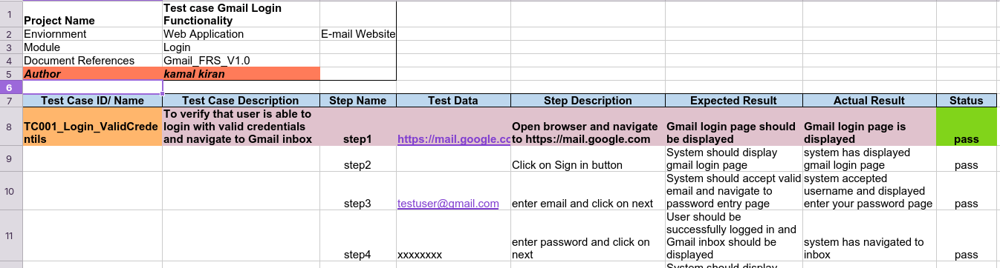
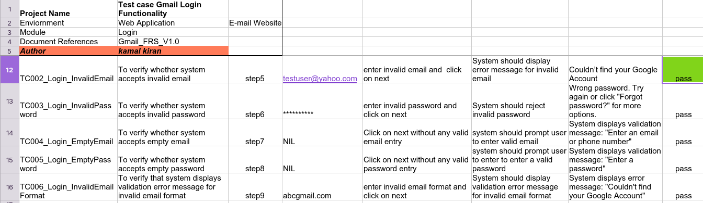

# Gmail Login Testing – Manual QA Project

This project focuses on testing the Gmail login functionality using manual testing techniques.

---

## 📌 Objective

To validate the login functionality of Gmail using different test scenarios including valid, invalid, and edge cases.

---

## 🧪 Test Coverage

• Positive login scenarios (valid credentials)
• Negative scenarios (invalid email/password)
• Boundary cases (empty inputs, format validation)
• Error message validation
• Navigation & redirection checks

---

## 📂 Files

- Gmail_Login_Test_Cases.xlsx (contains all test scenarios)

---

## 📸 Screenshots

### Valid Login

### Invalid Login

---

## 🛠️ Testing Type

- Functional Testing
- UI Testing
- Negative Testing

---

## ✅ Skills Demonstrated

- Test Case Design
- Functional Testing
- Bug Identification
- Validation Techniques

## 🔍 Key Learnings

- Understood real-world login validation scenarios
- Practiced writing positive and negative test cases
- Validated error handling and user feedback
- Improved test case structuring and documentation
