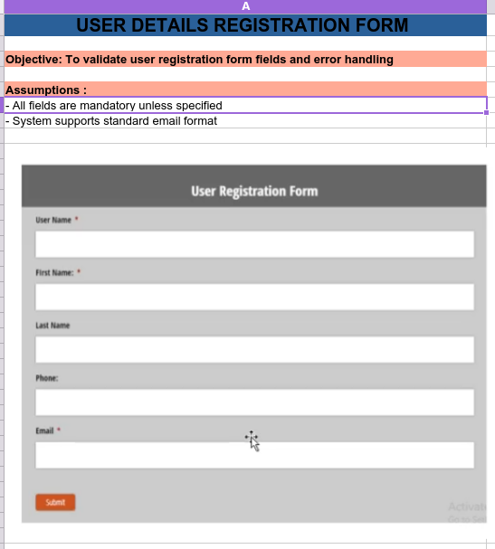
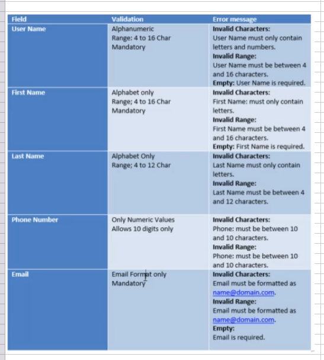
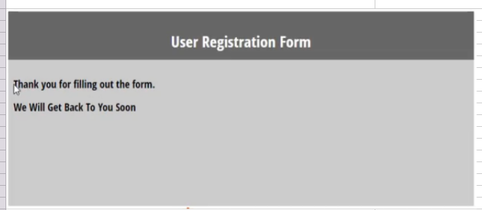
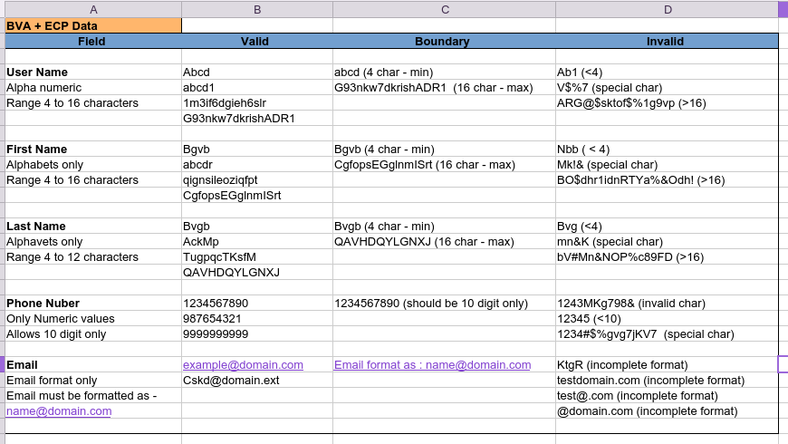
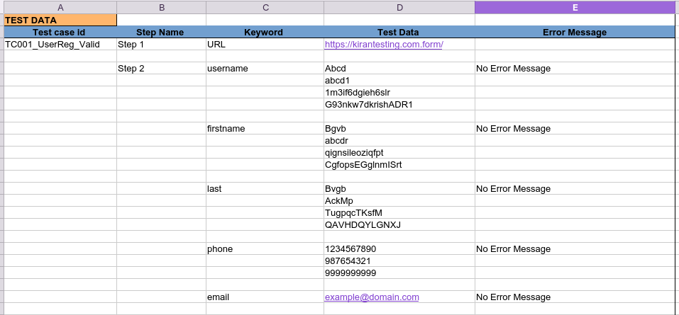
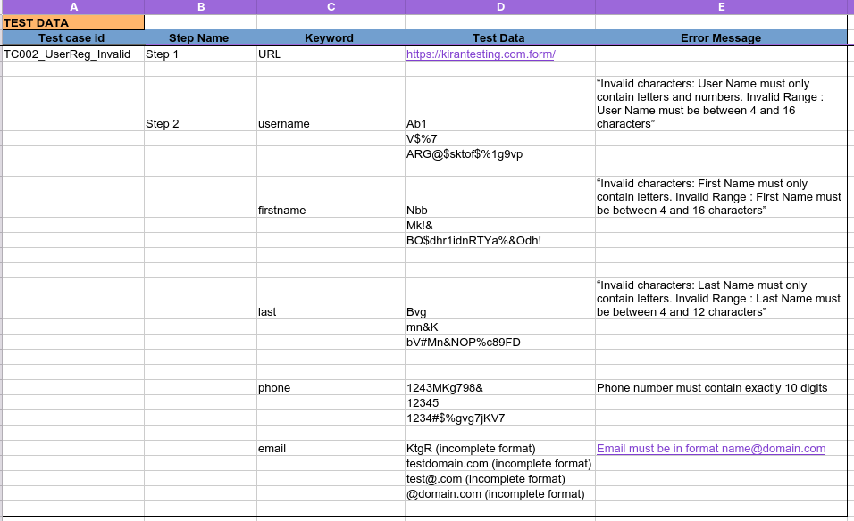
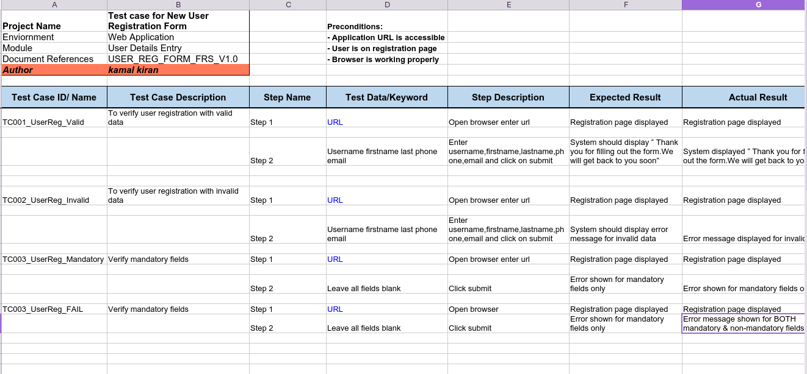
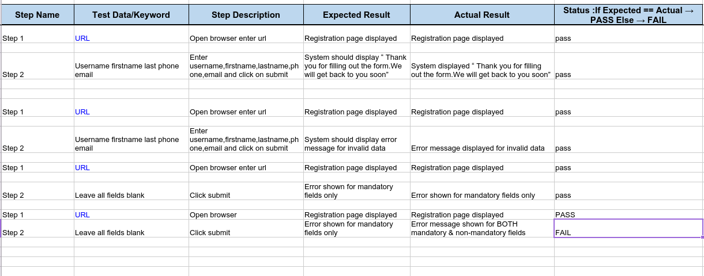

# User Registration Form Testing – Manual QA Project

🔗 Application Type: Demo User Registration Form (Static Testing)

📸 Reference: See screenshots below for UI and validation behavior.

## 📌 Objective
To validate registration functionality using positive, negative, and boundary test scenarios.

## 🧪 Test Coverage
- Valid registration scenarios
- Invalid inputs validation
- Required field validation
- Error message validation

## 📁 Files
- [User-Reg-Form-Project.xlsx](./User-Reg-Form-Project.xlsx) (Includes validation,mandatory,fail test cases)

## 📸 Screenshots

### User Registration Form

### FRS Validation

### Registration Succesfull

### Input Values- BVA+ECP Data

### Valid Testdata

### Invalid Testdata

### Registration Testcase

### Failed Testcase 

## 🛠 Testing Type
- Functional Testing
- UI Testing
- Negative Testing

## ✅ Skills Demonstrated
- Test Case Design
- Input Validation Testing
- Bug Identification
- Boundary Value Analysis

## 🔍 Key Learnings
- Learned real-world form validations
- Practiced handling edge cases
- Improved test case structuring

⚠️ Note: This project is based on a sample registration form UI used for testing practice. 
All validations and test scenarios are derived from the form design and expected behavior.
