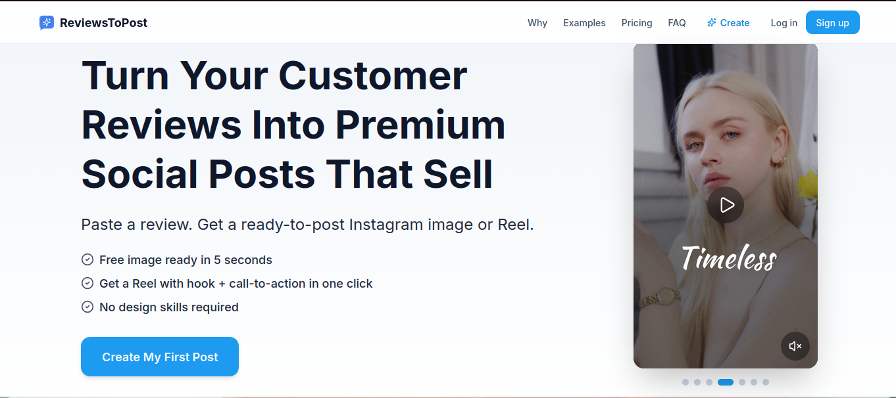
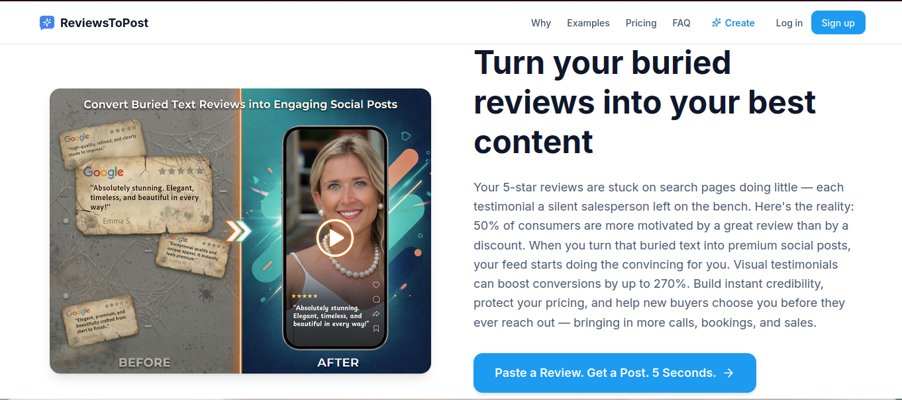
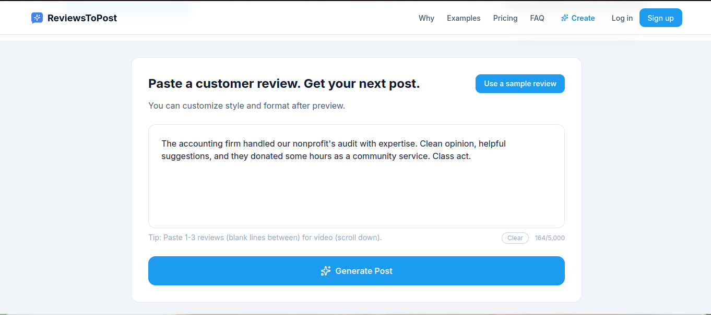
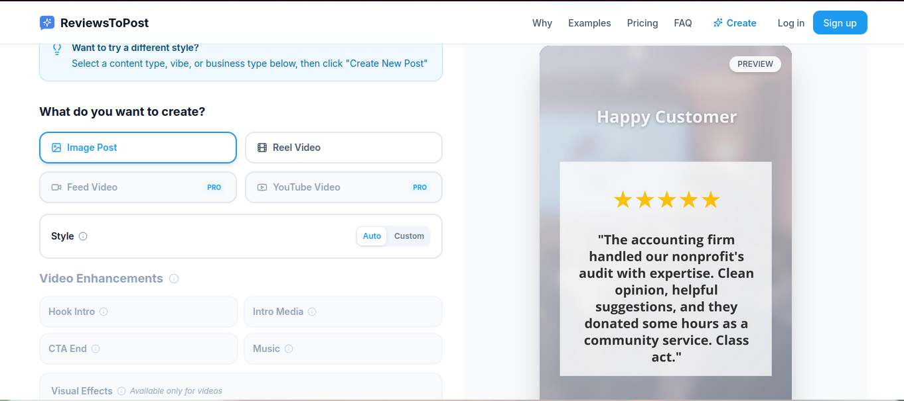
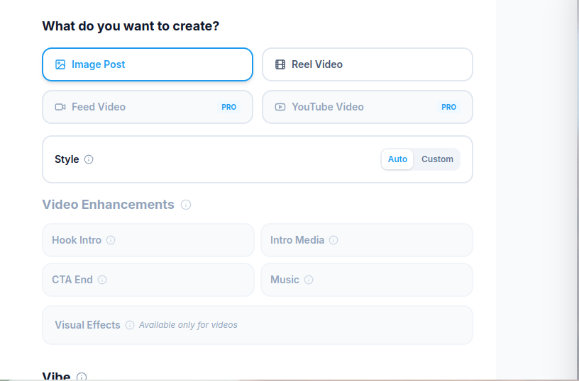
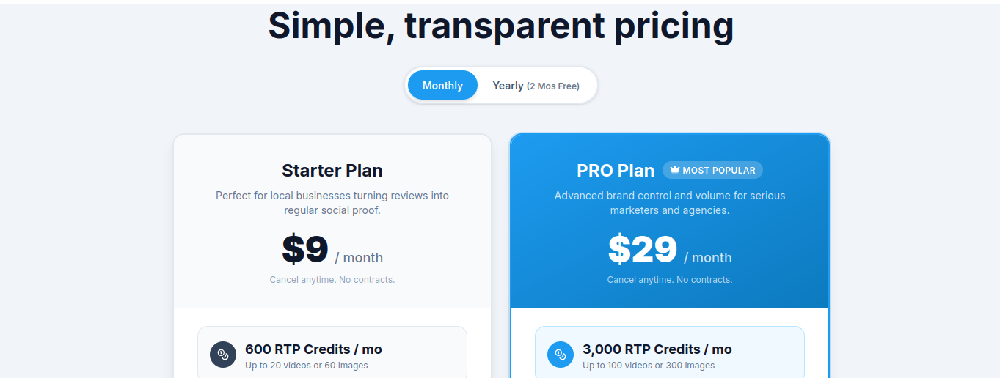

# Client Website Usability Testing

## Overview

📄 [View Full Usability Report](./reviewstopost-usability-report.docx)

This project contains usability testing performed on a live SaaS web application designed to convert customer reviews into social media posts.

## Objective
To evaluate the product from a small business user perspective and identify usability, UX, and conversion-related issues.

## Scope
- Homepage clarity and first impression
- Review-to-post workflow (input → preview → customization → output)
- Navigation and feature discoverability
- Pricing clarity and user trust factors

## Key Findings
- The product clearly communicates its core value of transforming reviews into social media content
- Workflow is simple and beginner-friendly, requiring no technical skills
- Minor usability gaps identified in onboarding and feature explanation
- Pricing may create hesitation for first-time users without trial confidence

## Deliverables
- Detailed usability testing report
- Screenshots from different testing stages
- UX improvement suggestions

## Folder Contents
- `reviewstopost-usability-report.docx` → Complete QA usability report
- `screenshots/` → Homepage, workflow, customization, pricing
- `README.md` → Project overview

## Tools Used
- Manual Testing
- Browser Testing

## Identified Usability Issues & Improvements

### 1. CTA Visibility
**Issue:** CTA button is not prominent above the fold  
**Impact:** Users may not notice main action → lower conversions  
**Suggestion:** Increase size, contrast, and visibility  

### 2. Input Guidance
**Issue:** Input box lacks example text  
**Impact:** New users may feel confused about what to enter  
**Suggestion:** Add placeholder or sample review text  

### 3. Output Clarity
**Issue:** Output section lacks clear action buttons  
**Impact:** Users may not know how to use/download result  
**Suggestion:** Add "Copy" and "Download" buttons  

### 4. Navigation Flow
**Issue:** Steps are not clearly defined  
**Impact:** Users may not understand process flow  
**Suggestion:** Add step indicators (Input → Generate → Output)  

### 5. Pricing Clarity
**Issue:** Pricing benefits are not clearly differentiated  
**Impact:** Users may hesitate to choose a plan  
**Suggestion:** Highlight key differences and value clearly

## Screenshots

### Homepage

### CTA & Navigation

### Input Box

### Output Preview

### Customization Options

### Pricing Section

